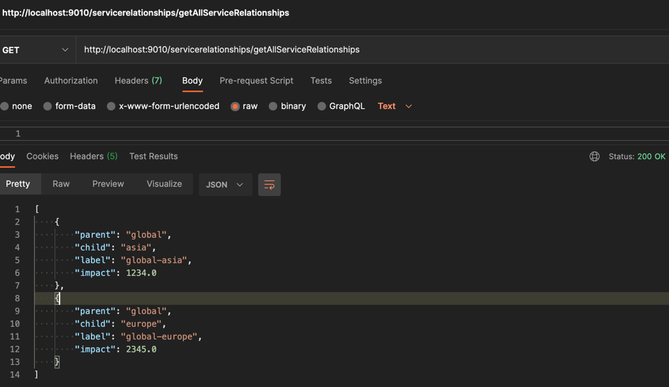
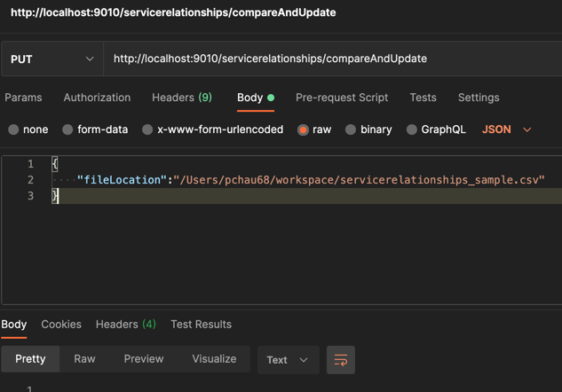

# Service Relationship

## Application Links

- http://localhost:9010/servicerelationships/uploadCsv
  

- http://localhost:9010/servicerelationships/getAllServiceRelationships
  

- http://localhost:9010/servicerelationships/getServiceRelationshipsByParentAndChild/{parent}/{child}
  

- http://localhost:9010/servicerelationships/compareAndUpdate
  

## Local Deployment

Server Port: HTTP: 9010

To run registration service:

(1) Mention profile local as shown below

(2) To start, Run ServiceRelationshipsApplication.java

(3) To start from Terminal, Navigate to path /target and then execute below command

java -jar service-relationship-0.0.1-SNAPSHOT.jar --spring.profiles.active=local

## Assumptions

- As mentioned in task, we have considered file location in request body parameter instead of taking as multipart file object

## Requirement 3 - Validate that the incoming CSV file contains a valid graph of nodes

- As part of requirement, we need to show if CSV contains a valid graph of nodes.
  For example, We have following entries in CSV

  Parent,Child,Label,Impact
  global,asia,global-asia,123456F
  asia,india,global-asia,123456F
  global,india,global-asia,123456F

  So, in above example, as we can see asia is a child to parent global and india is a child to asia, but again india is a child
  to global which represent a cycle.
   
  But if we see below example we don't have any cycle

  Parent,Child,Label,Impact
  global,asia,global-asia,123456F
  asia,india,global-asia,123456F
  
  To find if given CSV (Directed graph) has any cycle or not, we can use Depth First Search approach.
  